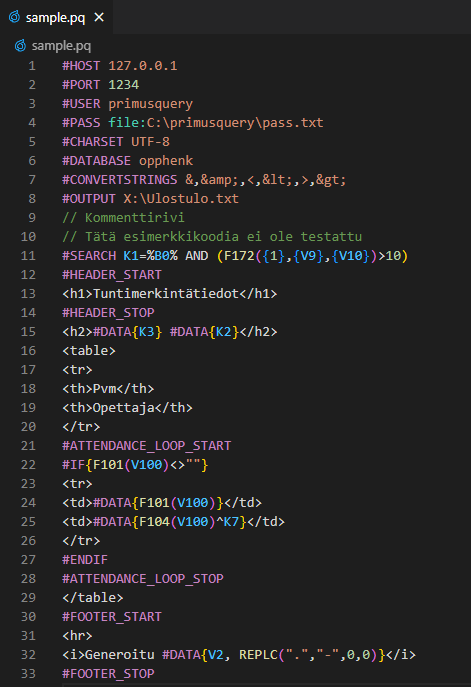

# PrimusQuery-kielituki

Tämä Visual Studio Code -lisäosa tarjoaa syntaksivärityksen PrimusQuery-kielelle. **Lisäosa ei ole virallinen Visman tuote.**

Assosioidut tiedostotyypit ovat *.pq ja *.primusquery.

## Julkaisut

### 1.0.0 (2.8.2023)

* Syntaksiväritys kielelle
* Tiedostotyypin kuvake
* Itsestään sulkeutuvat komentoparit, kuten #IF, #ENDIF ja #LINE_START, #LINE_STOP
* Ensimmäinen julkaisu

## Lisäosan kehittäminen

Olennaisimmat seikat:
* Syntaksiväritys on määritetty syntaxes/primusquery.tmLanguage.json-tiedostossa. Määrityksen muotoa kutsutaan TextMate Grammar (JSON). 
* Painamalla `F5` saa esikatseltua lisäosaa Extension Development Hostissa. (määritelty .vscode/launch.json) 
* Komennolla `workbench.extensions.action.installExtensionFromLocation` saa asennettua lisäosan paikallisesta polusta.
* Ei asennettavia riippuvuuksia.

Hyödyllisiä resursseja:
* Visual Studio Coden dokumentaatiossa on kerrottu lisää kielilisäosista: 
    
    https://code.visualstudio.com/api/language-extensions/overview
* TextMate Language Grammars -dokumentaatio: 
    
    https://macromates.com/manual/en/language_grammars
* PrimusQuery-manuaali, Visma

Jatkokehitysideat:
* Code Completion
    * Kenttäehdotukset/-kuvaukset Primus-kantamäärityksistä nykyisen rekisterin mukaan
    * Komentoehdotukset
    * Funktio- ja vakioehdotukset
* Sisäänrakennettu kyselyiden ajaminen
    * Suorita-painike
    * (Ulostulon tarkastelu)
    * Primusquery.exe-polun ja yhteyden määritys
## Huomio

Tämä ohjelma ei ole missään muodossa kytköksissä, yhteistyössä, valtuutettu, tuettu tai virallisesti yhteyksissä Vismaan tai mihinkään sen tytäryhtiöihin tai yhteistyökumppaneihin. Visman virallinen kotisivu löytyy osoitteesta https://www.visma.fi/.

Nimet Visma, Primus ja Visma InSchool ovat muiden liittyvien nimien, logojen ja kuvien lailla omistajiensa rekisteröityjä tavaramerkkejä.
